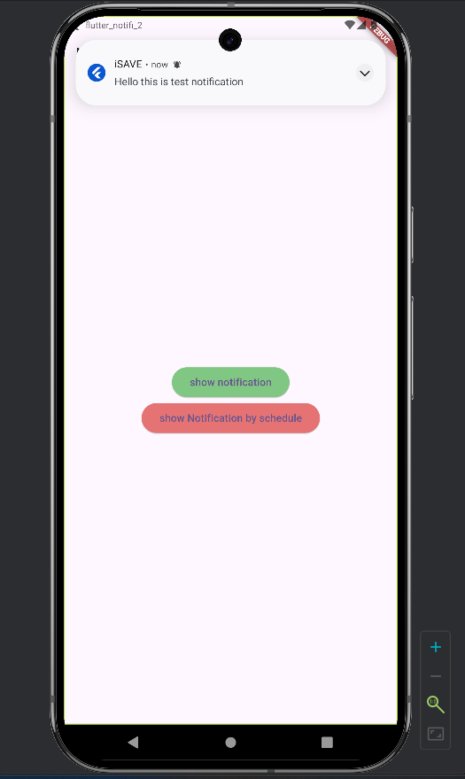

# Flutter Local Notification

This code how to implement local notifications in a Flutter app following Tutorial from `Mitch Koko` 
https://www.youtube.com/watch?v=uKz8tWbMuUw&t=401s
https://www.youtube.com/watch?v=i98p9dJ4lhI
1.
## 📌 Installation

install the required Flutter packages:

```sh
flutter pub add flutter_local_notifications flutter_timezone timezone
```
`timezone` packages.
`flutter_local_notifications`: https://pub.dev/packages/flutter_local_notifications
`flutter_timezone` :https://pub.dev/packages/flutter_timezone
`timezone` :https://pub.dev/packages/timezone

2.
## 📱 Build Screens with Button & NotificationService following in lib like main,myhomescreen and NotificationService


## ⚙️ Configure AndroidManifest.xml

Make the necessary modifications in the `AndroidManifest.xml` file located at:

```
\android\app\src\main\AndroidManifest.xml
```

Ensure the required permissions and services are added.

## 🎯 Result

Here is the result:




thzQ
